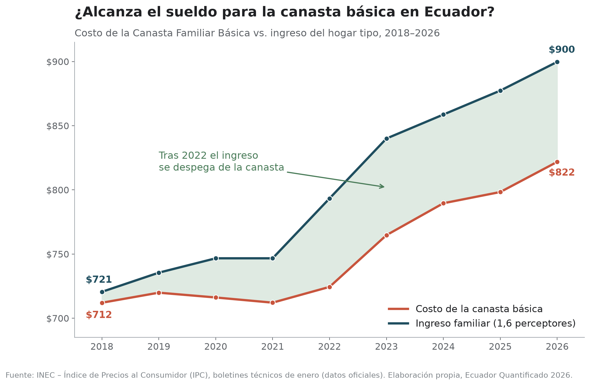
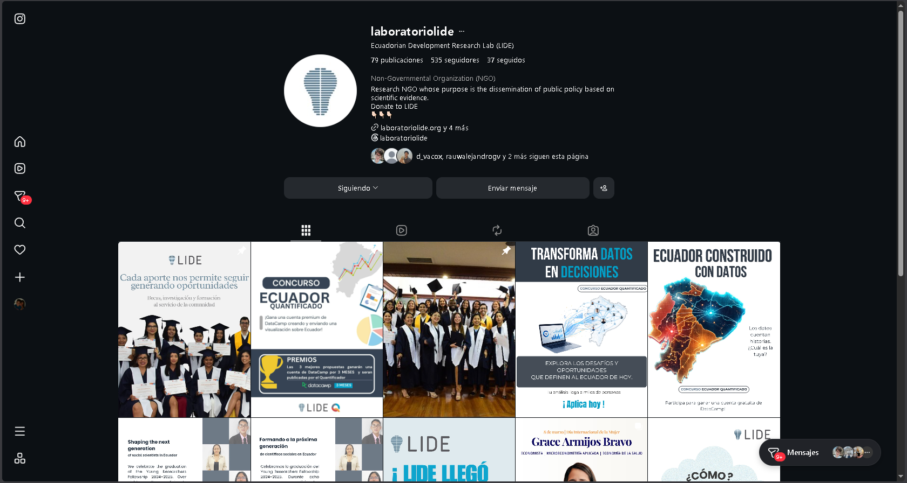
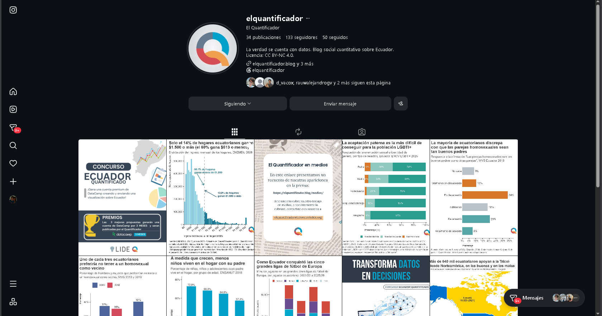
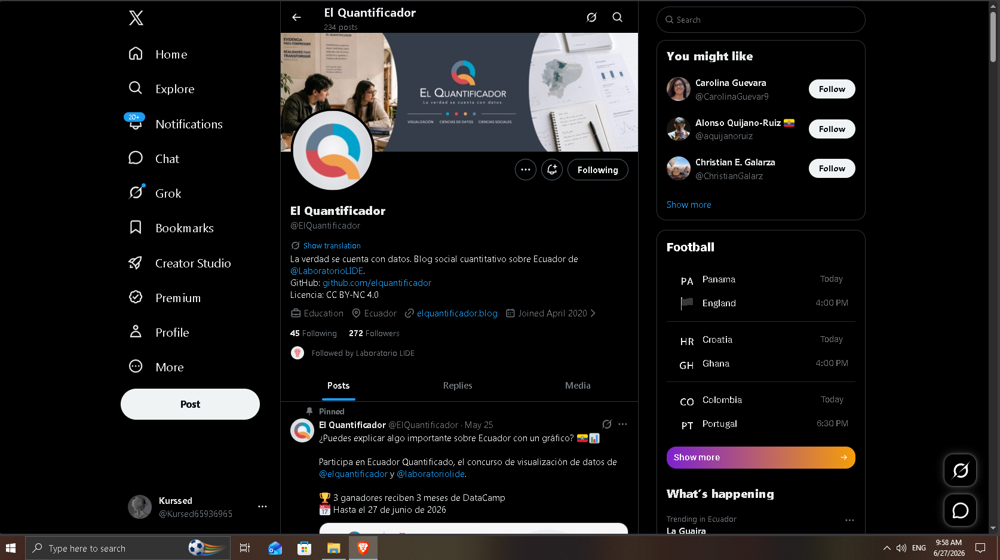
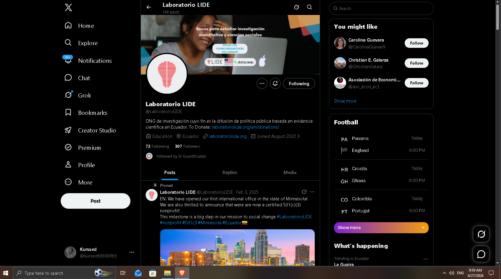
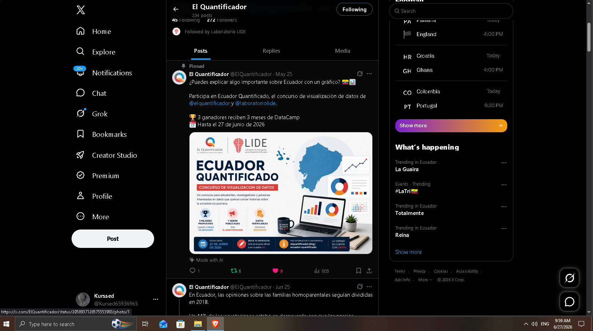
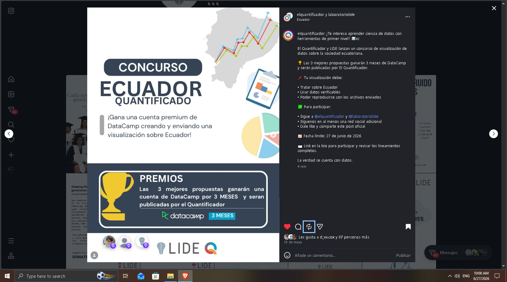
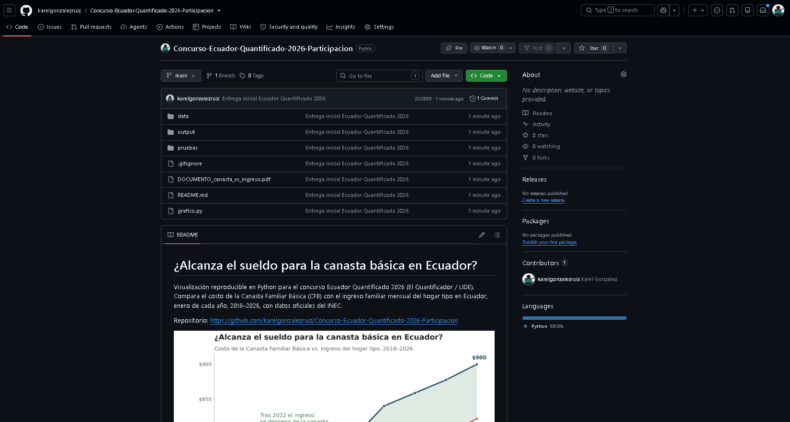

# ¿Alcanza el sueldo para la canasta básica en Ecuador?

Visualización reproducible en Python para el concurso **Ecuador Quantificado 2026**
(El Quantificador / LIDE). Compara el costo de la Canasta Familiar Básica (CFB)
con el ingreso familiar mensual del hogar tipo en Ecuador, enero de cada año,
**2018–2026**, con datos oficiales del INEC.

**Repositorio:** https://github.com/karelgonzalezruiz/Concurso-Ecuador-Quantificado-2026-Participacion



## Estructura

```text
.
├── grafico.py                      # genera el gráfico a partir del CSV
├── data/
│   └── canasta_vs_ingreso.csv      # datos oficiales del INEC (con enlaces a la fuente)
└── output/                         # se crea al ejecutar; aquí se guardan PNG y SVG
    ├── canasta_vs_ingreso.png
    └── canasta_vs_ingreso.svg
```

## Requisitos

- Python 3.9 o superior
- `pandas` y `matplotlib`

## Cómo ejecutar

1. Clona o descarga este repositorio y entra en la carpeta del proyecto.
2. Verifica que exista `data/canasta_vs_ingreso.csv` (la carpeta `data/` debe estar junto a `grafico.py`).
3. Instala las dependencias y ejecuta el script:

```bash
pip install pandas matplotlib
python grafico.py
```

El script crea automáticamente la carpeta `output/` si no existe y guarda el
gráfico en `output/canasta_vs_ingreso.png` (200 dpi) y `output/canasta_vs_ingreso.svg`.
No requiere argumentos ni configuración adicional.

En Windows (PowerShell) con entorno virtual aislado:

```powershell
python -m venv .venv
.\.venv\Scripts\activate
python -m pip install pandas matplotlib
python grafico.py
```

## Datos

Archivo: `data/canasta_vs_ingreso.csv`. Una fila por año, columnas:

| columna | descripción |
|---|---|
| `anio` | año (valor de enero) |
| `canasta_basica_usd` | costo de la Canasta Familiar Básica nacional, USD/mes |
| `ingreso_familiar_usd` | ingreso familiar del hogar tipo (1,6 perceptores), USD/mes |
| `salario_basico_usd` | salario básico unificado (SBU) del año |
| `fuente_ingreso` | boletín del INEC del que proviene el dato |
| `url_fuente` | enlace directo al boletín oficial para verificar cada cifra |

Todos los valores provienen de los boletines técnicos del IPC del INEC (sección
"Canastas Familiares", mes de enero). La columna `url_fuente` permite abrir el
boletín original de cada año y comprobar las cifras.

| Año | Canasta (USD) | Ingreso (USD) | SBU | Cobertura |
|----:|----:|----:|----:|----:|
| 2018 | 712.03 | 720.53 | 386 | 101% |
| 2019 | 719.88 | 735.47 | 394 | 102% |
| 2020 | 716.14 | 746.67 | 400 | 104% |
| 2021 | 712.11 | 746.67 | 400 | 105% |
| 2022 | 724.39 | 793.33 | 425 | 110% |
| 2023 | 764.71 | 840.00 | 450 | 110% |
| 2024 | 789.57 | 858.67 | 460 | 109% |
| 2025 | 798.31 | 877.33 | 470 | 110% |
| 2026 | 821.80 | 899.73 | 482 | 109% |

`Cobertura = ingreso_familiar_usd / canasta_basica_usd`.

## Definición del ingreso familiar (INEC)

Hogar tipo de 4 miembros con 1,6 perceptores que ganan el salario básico
unificado, incluyendo la parte proporcional mensualizada del décimo tercero y
cuarto sueldo (no considera fondos de reserva). Es el indicador que el INEC
publica en la sección "Canastas Familiares" de cada boletín.

## Verificación

La cobertura calculada para enero de 2026 (109%) coincide con el 109,48%
reportado oficialmente por el INEC en el boletín de ese mes.

## Fuentes

- Portal de canastas del INEC: https://www.ecuadorencifras.gob.ec/canasta/
- Boletines IPC del INEC: https://www.ecuadorencifras.gob.ec/estadisticas/
- Serie histórica (ANDA): https://anda.inec.gob.ec
- Enlace al boletín de cada año: columna `url_fuente` del CSV.

## Pruebas de participación

Requisitos del concurso completados (capturas en la carpeta [`pruebas/`](pruebas/)):

**Requisito 1 — Llenar el formulario de inscripción**

Formulario completado el 27 de junio de 2026.

**Requisito 2 — Seguir a @elquantificador y @laboratoriolide en Instagram**





**Requisito 3 — Seguir en una plataforma adicional (X / Twitter)**





**Requisito 4 — Dar like y compartir el post oficial del concurso**





**Requisito 5 — Incluir los datos y pasos para reproducir (repositorio público)**



## Licencia y créditos

Datos: INEC. Visualización: elaboración propia para Ecuador Quantificado 2026.
